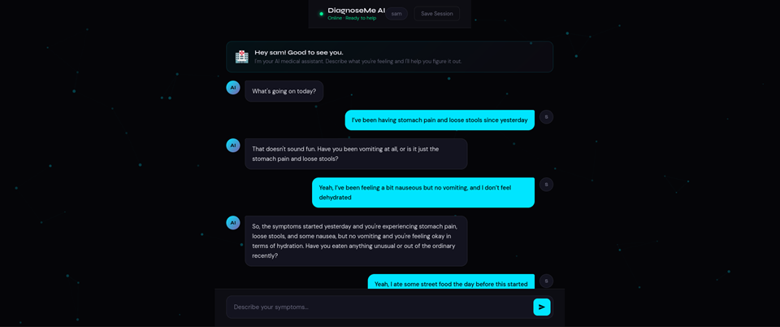
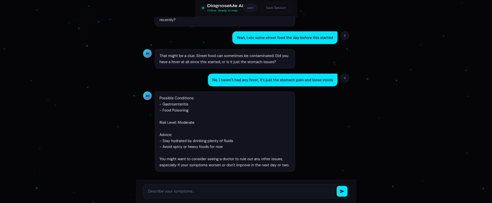

# DiagnoseMe AI

DiagnoseMe AI is an AI-powered preliminary medical assistant built to give users a reliable first opinion based on their symptoms. The idea started during a biology class and grew into a full GenAI project focused on solving real-world healthcare access problems. The system remembers important user information like allergies, existing conditions, and medications, so when a user logs in and describes symptoms, the AI can ask relevant follow-up questions and respond with literature-grounded possible conditions and precautions. It also maintains session history, making future interactions more context-aware and personalized.

The goal behind DiagnoseMe AI is to make basic medical guidance more accessible. Not everyone has easy access to a doctor, especially in remote areas, and even in cities people often look for quick reassurance before deciding whether to seek professional help. This system is designed to provide that first layer of clarity - helping users understand whether something might be serious or not. It is not a replacement for doctors, but a tool to make early healthcare support more reachable.

The system is built using Python and Flask, with the Groq API running Llama 3.3 for fast reasoning, SQLite for storing user data and session history, and a RAG pipeline that retrieves relevant medical information from a structured dataset before generating responses. This ensures the assistant is grounded in data rather than relying only on model knowledge. Uses a structured medical dataset (symptoms, descriptions, precautions) for RAG-based retrieval.

Future improvements include specialist routing (where the AI suggests the right type of doctor), stronger RAG with richer diagnostic datasets, support for medical imaging such as rash photos or scans, a doctor validation layer before prescriptions, and a mobile application.

This is my first major project, but definitely not the last.

Tech Stack
- Backend: Python + Flask
- AI Model: Llama 3.3 (Groq API)
- Database: SQLite
- RAG: TF-IDF with medical dataset (source:Kaggle)
- Frontend: HTML / CSS / JavaScript

## Disclaimer

This project is intended for informational purposes only and is not a substitute for professional medical advice.

## 📸 Demo

### Chat Interaction

### Diagnosis Output

### UI

